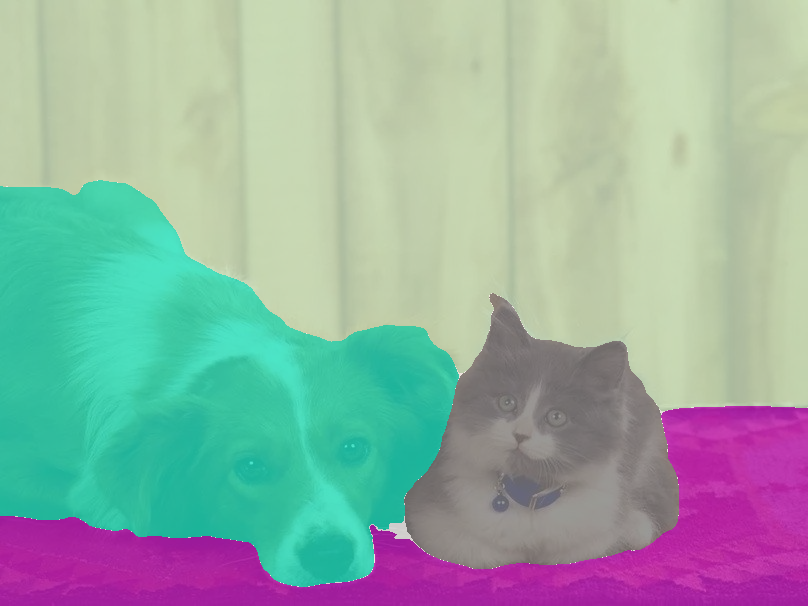
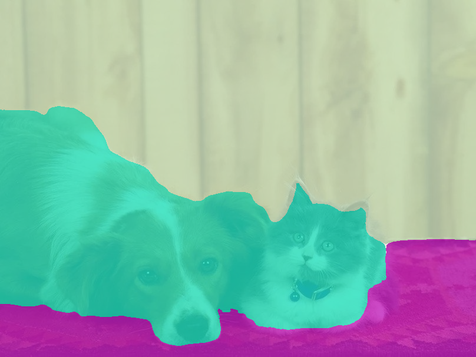

This repository contains the source code of our paper:
[Wei Yin, Yifan Liu, Chunhua Shen, Anton van den Hengel, Baichuan Sun, The devil is in the labels: Semantic segmentation from sentences](https://arxiv.org/abs/2202.02002)


Embedding: https://cloudstor.aarnet.edu.au/plus/s/gXaGsZyvoUwu97t
CKPT: https://cloudstor.aarnet.edu.au/plus/s/AtYYaVSVVAlEwve


## Define the label list
You can choose the label list used for semantic segmentation, for instance:
```python
python tools/test.py --config test_720_ss --user_label dog mouse horse rug_floormat wall person vegetation pizza
```
Here is the comparison between adding label "cat" or not:




## Define new labels
You can also define your own categories described by sentences, for instance:
```python
python tools/test.py --config test_720_ss --new_definitions="{'deer': 'This is an image of deer, similar to sheep or dog.'}"
```
